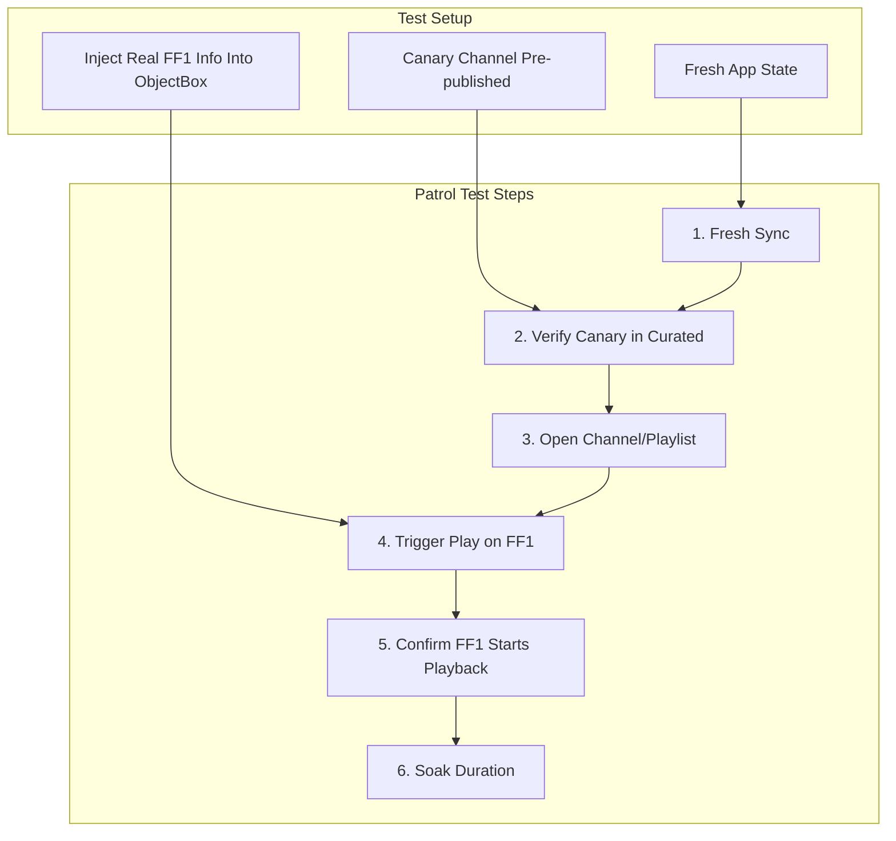

# Gold Path Patrol UI Automation Test (Updated)

## Scope

Automate the gold path as a Patrol-based UI test:

- Steps 1–6: Fresh sync → canary present in Curated surface → open Channel/Playlist → Play on FF1 → FF1 cast initiated
- Step 7: 4+ hour soak treated as configurable (short for CI, full for nightly) or separate run
- CI: `.github/workflows/gold-path-ui.yml` runs **smoke** on PR (1 min soak) and **endurance** on the same nightly cron as `nightly-integration.yml` (default 240 min soak); see `.github/actions/gold-path-patrol/action.yml`.

## FF1 Device Injection (Bypass BLE Pairing)

**Real FF1 hardware** is used; Bluetooth pairing cannot be automated.

**Approach:** Programmatically inject **real device information** (deviceId, relayer topicId) into ObjectBox during test bootstrap, assuming the pairing flow was already completed manually. The test simulates the post-pairing state so the app can cast to the real FF1 without running the BLE flow.

### Injection Flow

1. In `createAppForPatrol()`, replicate `main.dart` bootstrap (ObjectBox init, `FF1BluetoothDeviceService` creation).
2. **Before** `$.pumpWidgetAndSettle(App(...))`, inject real device info:
   - `bluetoothDeviceService.putDevice(testDevice)`
   - `bluetoothDeviceService.setActiveDevice(testDevice.deviceId)`
3. `FF1Device` uses **real values** from env/config:
   - `deviceId`: from `GOLD_PATH_FF1_DEVICE_ID` (device ID shown on FF1)
   - `topicId`: from `GOLD_PATH_FF1_TOPIC_ID` (relayer topic for cast)
   - `remoteId`: placeholder (e.g. `00:00:00:00:00:00`) – not used for cast
   - `name`: `Gold Path Test FF1` or from env
   - `branchName`: `release`

### Precondition

- FF1 hardware is physically present and was paired manually (outside the test).
- Device ID and topic ID are known and passed into the test (env vars or config).
- Test assumes pairing is done; injection simulates "we just finished pairing."

### Expected Behavior

- `activeFF1BluetoothDeviceProvider` emits the injected device → FFDisplayButton appears.
- Tapping Play casts to the **real FF1** via relayer.
- Playback runs on real hardware; 4h soak validates stability.

## Architecture



## Key Implementation Details

### 1. Patrol Setup (new)

- Add `patrol` to `dev_dependencies` in [pubspec.yaml](pubspec.yaml)
- Add `patrol` section with:
  - `app_name: Feral File`
  - Android `package_name`: `com.feralfile.app.inhouse` (development flavor)
  - iOS `bundle_id`: `com.feralfile.app`
  - `test_directory: patrol_test`
  - `flavor: development`
- Create `patrol_test/` directory; add `patrol_test/test_bundle.dart` to `.gitignore`
- Install Patrol native hooks per [Patrol setup docs](https://patrol.leancode.co/documentation)

### 2. Test Entry and Fresh State

- **Fresh app state**: Clear app data before launch (Android: `adb shell pm clear com.feralfile.app.inhouse`) or run from clean install.
- **App init**: Create `createAppForPatrol()` that mirrors `main.dart` bootstrap, plus **FF1 device injection** (real deviceId, topicId from env), then `$.pumpWidgetAndSettle()`.
- **Env vars for injection**: `GOLD_PATH_FF1_DEVICE_ID`, `GOLD_PATH_FF1_TOPIC_ID` (required when running with real hardware).

### 3. Gold Path Steps

| Step | Action | Patrol Finders |
|------|--------|----------------|
| 1 | Fresh sync completes | Wait for "Curated" section; skip onboarding if needed |
| 2 | Canary present | Find canary by text or Key; assert visible |
| 3 | Open Channel/Playlist | Tap work in canary channel carousel → Work detail |
| 4 | Play on FF1 | Tap FFDisplayButton (fake device already "paired" via injection) |
| 5 | FF1 starts playback | Assert Now Displaying visible; real FF1 receives cast |
| 6 | Soak | `await Future.delayed(soakDuration)` (configurable) |

### 4. Test Keys and Finders

Add semantic keys for automation (see [Patrol write-your-first-test](https://patrol.leancode.co/documentation/write-your-first-test)):

- Keys for: Channels tab, Curated section, canary channel row, work item, FFDisplayButton, Now Displaying bar
- Add `Key` widgets to: [home_index_page.dart](lib/ui/screens/home_index_page.dart), [channels_tab_page.dart](lib/ui/screens/tabs/channels_tab_page.dart), [channel_list_row.dart](lib/widgets/channels/channel_list_row.dart), [work_detail_screen.dart](lib/ui/screens/work_detail_screen.dart), [playlist_detail_screen.dart](lib/ui/screens/playlist_detail_screen.dart), [now_displaying_bar.dart](lib/widgets/now_displaying_bar/now_displaying_bar.dart)

### 5. Canary Channel Identity

- Define via env or const (e.g. `GOLD_PATH_CANARY_CHANNEL_ID` / `GOLD_PATH_CANARY_CHANNEL_TITLE`)
- Precondition: Canary exists in seed DB as deterministic artifact

### 6. Onboarding

- Complete onboarding (skip add address, skip FF1 setup) to reach home; no FF1 setup flow needed since device is injected.

### 7. 4+ Hour Soak

- CI: Short soak (e.g. 30–60 s)
- Nightly: Configurable (e.g. `GOLD_PATH_SOAK_MINUTES=240`) or separate target

## File Structure

```
patrol_test/
  common.dart              # createAppForPatrol(), injectPatrolDevice(deviceId, topicId from env)
  keys/
    gold_path_keys.dart       # Key definitions
  gold_path_test.dart  # Main Patrol test
```

## Out of Scope

- Automated BLE pairing (manual pairing assumed; injection bypasses it)
- New IA/shelves, pairing redesign, licensing, stewardship, scheduling
